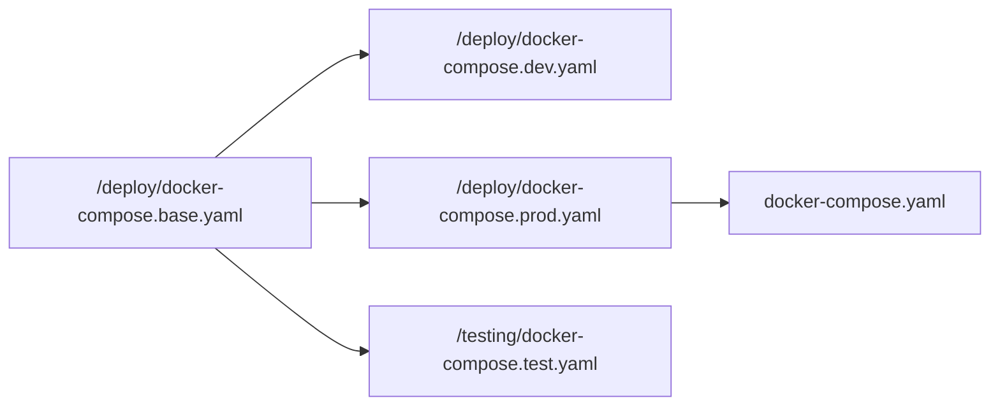
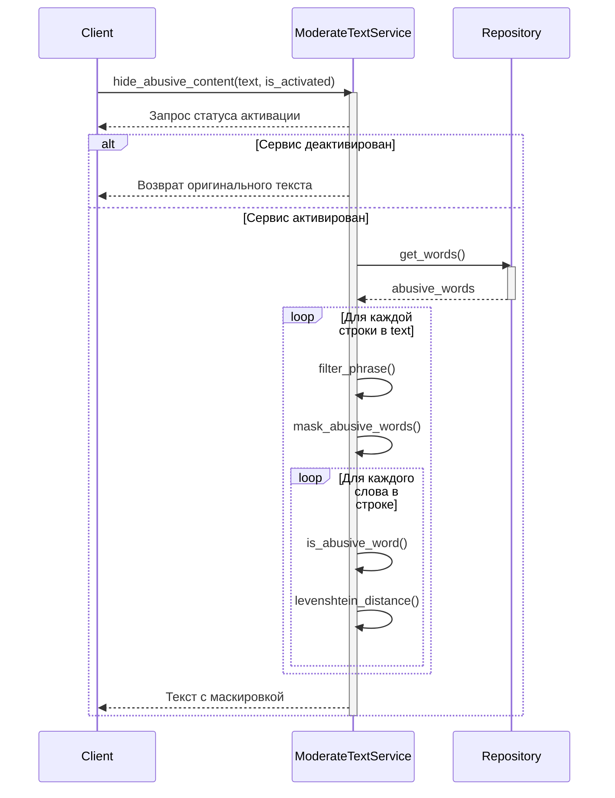
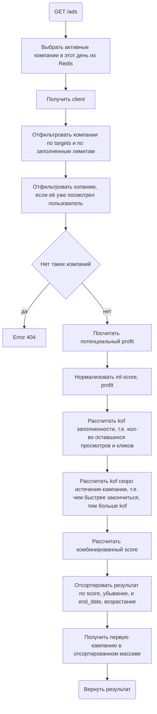

# AdEngine

| Сервис     | Путь                                                             |
|------------|------------------------------------------------------------------|
| Swagger    | [127.0.0.1:8000/docs/](http://127.0.0.1:8000/docs/)              |                                   
| Tg bot     | [@ad_engine_from_prod_bot](https://t.me/ad_engine_from_prod_bot) |                                   
| Prometheus | [127.0.0.1:9090/](http://127.0.0.1:9090/)                        |                                   
| Grafana    | [127.0.0.1:3000/](http://127.0.0.1:3000/)                        |

## Launch

1) Clone репозитория
    ```powershell
    git clone https://gitlab.prodcontest.ru/2025-final-projects-back/IOSHED.git
    ```
   
2) Установите `docker-compose`

3) Перейдите в директорию solution
    ```powershell
    cd solution
    ```

4) Запустите мой контейнер [`docker-compose для продакшена`](./deploy/docker-compose.prod.yaml):
    ```powershell
     docker-compose -f ./deploy/docker-compose.prod.yaml up -d
    ```

### Устройство моего контейнера

[Контейнер](./deploy/docker-compose.prod.yaml) содержит:

| Сервис       | Предназначение                                 | Зависит от           |
|--------------|------------------------------------------------|----------------------|
| grafana      | Просмотр метрик                                | `prometheus`         |
| prometheus   | Хранение метрик                                | `ad_engine`          |
| postgres     | Хранение долговременных данных                 |                      |
| redis        | Кеширование и хранение недолговременных данных |                      |
| ad_engine    | `Http` сервис предоставляющий API AdEngin      | `postgres`, `redis`  |
| telegram_bot | Телеграм бот, использующий `ad_engine`         | `ad_engine`, `redis` |

Все `docker-compose` наследуются, для более тонкой настройки по примеру схемы:

```mermaid 
graph LR
  D["/deploy/docker-compose.dev.yaml"]
  P["/deploy/docker-compose.prod.yaml"]
  B["/deploy/docker-compose.base.yaml"]
  T["/testing/docker-compose.test.yaml"]
  PP["docker-compose.yaml"]

  B --> D
  B --> P
  B --> T
  P --> PP
```

## Technologies used

| Технология                             | №1                                              | №2                                                   | №3                                       |
|----------------------------------------|-------------------------------------------------|------------------------------------------------------|------------------------------------------|
| Grafana                                | Гибкая настройка графиков                       | Продвинутый и красивый ui                            | Богатое сообщество пользователей         |
| Prometheus                             | Возможность гибких запросов к данным            | Система опрашивания других сервисов для сбора метрик | Простота хранения метрик                 |
| Postgres                               | Универсальная `SQL` база данных                 | Бескрайние возможности плагинов                      |                                          |
| Redis                                  | Хранение данных в оперативной памяти (скорость) | Простота использования                               | Самая популярная `in-memory` база данных |
| Aiogram dialog + Python (telegram_bot) | Табличная система создания диалогов             | Гибкие callback'и                                    | Скорость разработки бота                 |
| Actix + Rust (ad_engine)               | Высокая производительность                      | Простая документация                                 | Множество `futures` из других `crates`   |
| Sqlx + Rust (ad_engine)                | Чистые `SQL` запросы                            | Простая система миграций                             | Множество `futures` из других `crates`   |
| Yandex GPT                             | Российский разработчик                          | Высокая скорость генерации текста                    | Относительная дешевизна тарифов          |

## Main Endpoints

Упомянуты будут только главные и уникальные `endpoint'ы`.

### Campaigns

Генератор текста для рекламных компаний (PATCH `/advertisers/{advertiser_id}/campaigns/{campaign_id}/generate_text`):

Использует yandex gpt, отсылая ей `http` запрос. Если корректный ответ не был получен возвращается ошибка `503`. Применяется только для уже созданных рекламных компаний, и вызвращает результат в ввиде изменённой сущности `campaign`.
Для запроса следует указать:

- ad_text (опционально): ключевые слова для текста рекламы. Если не указано, то ключевые слова берутся из уже созданной `campaign`.
- ad_title (опционально): ключевые слова для заголовка рекламы. Если не указано, то ключевые слова берутся из уже созданной `campaign`.
- generate_type (ALL | TEXT | TITLE): указывает какие текстовые поля сгенерировать для `campaign`.

Input json example:
  ```json
  {
    "ad_text": "Пользовательские ключевые слова для содержимого рекламы",
    "ad_title": "Пользовательские ключевые слова для заголовка рекламы",
    "generate_type": "ALL"
  }
  ```
 
Output json example:
  ```json
    {
    "ad_title": "Nt",
    "ad_text": "His omega must be Ad",
    "advertiser_id": "3fa85f64-5717-4562-b3fc-2c963f66afa6",
    "campaign_id": "3fa85f64-5717-4562-b3fc-2c963f66afa6",
    "clicks_limit": 105,
    "impressions_limit": 25,
    "cost_per_click": 150,
    "cost_per_impression": 100,
    "end_date": 5,
    "start_date": 3,
    "targeting": {}
  }
  ``` 

[Генерация текста](./media/генерация%20текста.gif)


Настройка осуществляется путём редактирования файлов конфигураций в [`ad_engine`](/microservices/ad_engine/conf/base.yaml)

| Настройка                        | Тип               | Описание                                                            |
|----------------------------------|-------------------|---------------------------------------------------------------------|
| temperature                      | float (от 0 до 1) | Креативность ответов `llm`                                          |
| max_tokens                       | integer (от 1)    | Ограничение на ответ нейросети в виде количества токенов            |
| system_prompt_for_generate_title | string            | Системный промт для генерации текста заголовка рекламной кампании   |
| system_prompt_for_generate_body  | string            | Системный промт для генерации текста содержимого рекламной кампании |

### Images

| Путь                                                                      | Метод  | Краткое описание                                                                                                                                                                                                                                                                              |
|---------------------------------------------------------------------------|--------|-----------------------------------------------------------------------------------------------------------------------------------------------------------------------------------------------------------------------------------------------------------------------------------------------|
| `/advertisers/{advertiser_id}/campaigns/{campaign_id}/images`             | GET    | Получает список имён всех загруженных фотографий в рекламную кампанию                                                                                                                                                                                                                         |
| `/advertisers/{advertiser_id}/campaigns/{campaign_id}/images`             | POST   | Загружает фотографии (храня её в `postgres`) в рекламную кампанию, используя  заголовок `Content-Type: multipart/form-data`. Можете протестировать это например написав небольшую форму [тык.](./media/index.html) (только не забудьте в запросе поменять uuid для `advertiser` и `campaign`) |
| `/advertisers/{advertiser_id}/campaigns/{campaign_id}/images/{file_name}` | DELETE | Удаляет фотографию из рекламной кампании по имени                                                                                                                                                                                                                                             |
| `/advertisers/{advertiser_id}/campaigns/{campaign_id}/images/{file_name}` | GET    | Получает фотографию рекламной кампании по имени                                                                                                                                                                                                                                               |

[Загрузка фотографий](./media/загрузка%20фотографий.gif)


Настройка осуществляется путём редактирования файлов конфигураций в [`ad_engine`](/microservices/ad_engine/conf/base.yaml)

| Настройка             | Тип            | Описание                                                                    |
|-----------------------|----------------|-----------------------------------------------------------------------------|
| support_mime          | array string   | Определяет поддерживаемые `mime` типы данных для загрузки.                  |
| max_size              | integer (от 0) | Ограничение на размер одного изображения в килобайтах                       |
| max_image_on_campaign | integer (от 0) | Количество фотографий, разрешённых на хранение для одной рекламной кампании |
| limit_size_media      | integer (от 0) | Ограничение на размер группы мультимедиа в килобайтах                       |

### Moderate

| Путь               | Метод  | Краткое описание                                         |
|--------------------|--------|----------------------------------------------------------|
| `/moderate/config` | POST   | Включает/выключает модерацию текста во всем `ad_engine`  |
| `/moderate/list`   | POST   | Добавляет слова в чёрный список                          |
| `/moderate/list`   | DELETE | Удаляет слова из чёрного списка (является идемпотентным) |
| `/moderate/list`   | GET    | Получает слова из чёрного списка                         |

[Управление цензурой](./media/нецензурные%20слова.gif)


[Цензурирование уже созданных кампаний](./media/цензурирование%20уже%20созданных%20кампаний.gif)


| Настройка   | Тип               | Описание                                                                                                                                                                |
|-------------|-------------------|-------------------------------------------------------------------------------------------------------------------------------------------------------------------------|
| sensitivity | float (от 0 до 1) | Устанавливает чувствительность к словам и словоформам из чёрного списка (0 — самая низкая чувствительность, 1 — очень высокая). Рекомендую значения от `0.5` до `0.25`. |

При включенной модерации не получиться создать `client`, `advertiser`, `campaign` со словами или словоформами из чёрного списка. Будет ошибка `406` с `"reason": "Not acceptable words - {word}"`.

Если же вы добавили слово в чёрный список, когда уже сохранена `campaign`, то при получении `ads` (GET `/ads`) запретное слово будет заменено на `***`. Например, если запрещено слово `плохо`, то из текста `Это не хорошо, а пло][о.` клиент увидит `Это не хорошо, а ***.`

Это достигается благодаря моему алгоритму, включающий алгоритм Левенштейна:

```mermaid
%% Схема взаимодействия компонентов
sequenceDiagram
    participant Client
    participant ModerateTextService
    participant Repository

    Client->>ModerateTextService: hide_abusive_content(text, is_activated)
    activate ModerateTextService
    ModerateTextService-->>Client: Запрос статуса активации
    alt Сервис деактивирован
        ModerateTextService-->>Client: Возврат оригинального текста
    else Сервис активирован
        ModerateTextService->>Repository: get_words()
        activate Repository
        Repository-->>ModerateTextService: abusive_words
        deactivate Repository
        loop Для каждой строки в text
            ModerateTextService->>ModerateTextService: filter_phrase()
            ModerateTextService->>ModerateTextService: mask_abusive_words()
            loop Для каждого слова в строке
                ModerateTextService->>ModerateTextService: is_abusive_word()
                ModerateTextService->>ModerateTextService: levenshtein_distance()
            end
        end
        ModerateTextService-->>Client: Текст с маскировкой
    end
    deactivate ModerateTextService
```

### ADS

Выдача наиболее подходящей рекламы (GET `/ads`).

Вот как работает основной алгоритм:

```mermaid
%% Flowchart основного алгоритма
flowchart TD
    A(GET /ads) --> B[Выбрать активные компании в этот день из Redis]
    B --> C[Получить client]
    C --> D[Отфильтровать компании по targets и по заполненным лимитам]
    D --> E[Отфильтровать копанию, если её уже посмотрел пользователь]
    E --> F{Нет таких компаний}
    F --> |да| ERROR[Error 404]
    F --> |нет| H[Посчитать потенциальный profit]
    H --> P[Нормализовать ml-score, profit]
    P --> R[Рассчитать kof заполненности, т.е. кол-во оставшихся просмотров и кликов]
    R --> L[Рассчитать kof скоро истечения кампании, т.е. чем быстрее закончиться, тем больше kof]
    L --> M[Рассчитать комбинированный score]
    M --> N[Отсортировать результат по score, убывание, и end_date, возрастание]
    N --> S[Получить первую кампанию в отсортированном массиве]
    S --> FINISH(Вернуть результат)
```

| Настройка          | Тип               | Описание                                                                   |
|--------------------|-------------------|----------------------------------------------------------------------------|
| weight_profit      | float (от 0 до 1) | Вес важности потенциальной прибыли                                         |
| weight_relevance   | float (от 0 до 1) | Вес важности релевантности рекламы                                         |
| weight_fulfillment | float (от 0 до 1) | Вес важности ненаполненности рекламы (недополучение потенциальной прибыли) |
| weight_time_left   | float (от 0 до 1) | Вес важности продвижения реклам, которые подходят к концу                  |

## View Tg Bot

### Чтобы начать работу в `@ad_engine_from_prod_bot` следует зарегистрироваться:

> Локацию пользователя бот получает по геоданным пользователя (используется [nominatim.openstreetmap.org](https://nominatim.openstreetmap.org/)).

[Создание клиента](./media/создание%20клиента.gif)


### В демонстрирующих целях можно сразу перейти в панель администрации, где можно промотать время, настроить модерацию текста:

> Для полного просмотра запретных слов бот выдаёт файл `csv`.

[Админ панель](./media/админ%20панель.gif)


### Любой желающий может зарегистрировать кампанию для размещения в будущем рекламы:

[Создание рекламодателя](./media/создание%20рекламодателя.gif)


### У `advertiser` есть возможность создать рекламную кампанию:

> Поля которые можно пропустить являются необязательными.

> При создании можно попросить по ключевым словам сгенерировать текст для рекламной кампании нейросетью.

[Создание рекламной кампании](./media/создание%20рекламной%20кампании.gif)


### `Advertiser` можно просмотреть свои рекламные кампании, увидеть их статистику и удалить, если понадобится:

[Управление своими кампаниями](./media/управление%20своими%20кампаниями.gif)


### Пользователи могут смотреть рекламу:

> При отклике на рекламу появляется надпись `👍🎈Спасибо за отклик`.

[Просмотр рекламы](./media/просмотр%20рекламы.gif)


### Если рекламы нет:

[Реклама отсутствует](./media/404%20нет%20рекламы.gif)


## Schema database


## Telemetry

Пример визуализации метрик:


## Scripts

### Как работать с [project](/scripts/project.bat)?

Эта документация предоставляет руководство по использованию предоставленного скрипта `.bat` или `.sh`, который позволяет пользователю запускать сервисы локально или в контейнерах Docker с различными действиями, такими как запуск или сборка сервисов.

### Usage

Чтобы запустить скрипт, выполните его в командной строке с необходимыми параметрами. Используйте следующий синтаксис:

Для Windows:
```shell
.\project.bat [options] [service]
```

Для Unix/Linux:
```shell
./project.sh [options] [service]
```

### Options

| Option         | Short Form | Description                         |
|----------------|------------|-------------------------------------|
| --local        | -L         | Запустить сервисы локально          |
| --docker       | -D         | Запустить сервисы в докер           |
| --run          | -R         | Запустить сервис(ы)                 |
| --build        | -B         | Собрать сервис(ы)                   |
| --help         |            | Вывести help сообщение              |
| --tests        |            | Запустить `unit` и `e2e` тесты      |
| --tests --init |            | Запустить тестирование в первый раз |

### Example Usage

- Start all services locally and run them:
    - Windows:
      ```shell
      .\project.bat --local --run
      ```
    - Unix/Linux:
      ```shell
      ./equivalent.sh --local --run
      ```

- Build a specific service locally:
    - Windows:
      ```shell
      .\project.bat --local travel_service --build
      ```
    - Unix/Linux:
      ```shell
      ./equivalent.sh --local travel_service --build
      ```

- Start services using Docker:
    - Windows:
      ```shell
      .\project.bat --docker --run
      ```
    - Unix/Linux:
      ```shell
      ./equivalent.sh --docker --run
      ```

- View help information:
    - Windows:
      ```shell
      .\project.bat --help
      ```
    - Unix/Linux:
      ```shell
      ./equivalent.sh --help
      ```

- Run tests:
    - Windows:
      ```shell
      .\project.bat --tests
      ```
    - Unix/Linux:
      ```shell
      ./equivalent.sh --tests
      ```
- First run tests:
    - Windows:
      ```shell
      .\project.bat --tests --init
      ```
    - Unix/Linux:
      ```shell
      ./equivalent.sh --tests --init
      ```

### Parameter Definitions

- **mode**: Определяет, будет ли скрипт выполнять команды локально или в Docker. Может быть установлен в `local` или `docker`.
- **action**: Указывает действие, которое необходимо выполнить (может быть либо `run`, либо `build`).
- **service**: (Необязательно) Конкретный сервис, который вы хотите выбрать для действия.

### Error Handling

- Если не указан ни `--local`, ни `--docker`, скрипт уведомит пользователя о недостаточной информации по режиму.
- Если не указано ни `--run`, ни `--build`, пользователь получит уведомление с просьбой указать действие.
