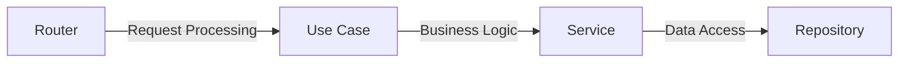
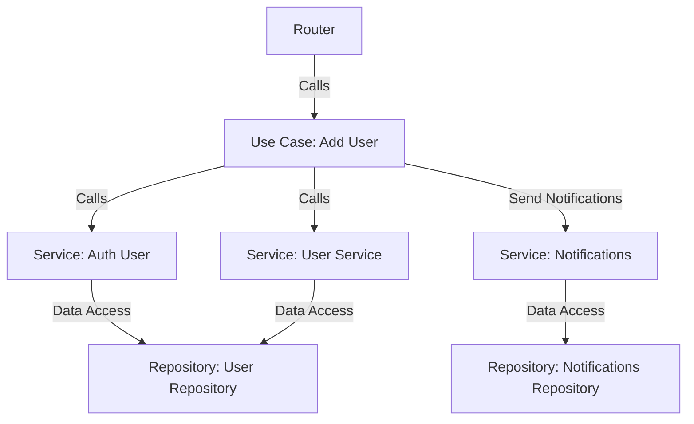

# Configuration

The project is configured from the [/conf](/conf) and `env`.

It is recommended to explicitly use the environment variable `APP_ENVIRONMENT` (values: `prod`, `local`), otherwise the default value (`prod`) will be substituted. For example:

```dotenv
APP_ENVIRONMENT=local
```

The configuration consists of three consecutive steps:

1. **Load** configuration from [base.yaml](/conf/base.yaml).
2. **Load or rewrite** configuration from [local.yaml](/conf/local.yaml) or [prod.yaml](/conf/prod.yaml) file according to the variable `APP_ENVIRONMENT`.
3. **Load or rewrite** configuration from `ENV` variable or [.env](/.env) file. In this case, the nesting is determined by the separator `__`. You should definitely add a prefix `APP__` to the variable. For example:

```dotenv
APP_ENVIRONMENT=local

# http_server.port
APP__HTTP_SERVER__PORT=8000
# http_server.host
APP__HTTP_SERVER__HOST="127.0.0.1"
```

# Architecture

Project uses `clean architecture` with the following folder structure:

| Name of Folder                         | Description                                                 | Example Body                                           | Depends On                                                     |
|----------------------------------------|-------------------------------------------------------------|--------------------------------------------------------|----------------------------------------------------------------|
| [infrastructure](./src/infrastructure) | Contains components for interaction with external resources | `redis`, `database`, `config`, `repository`            | `None`                                                         |
| [domain](./src/domain)                 | Holds core business logic, types, and services              | `validators`, `types`, `services`, `schemas`, `traits` | [infrastructure](./src/infrastructure)                         |
| [interface](./src/interface)           | Manages communication between user interactions and backend | `http_client`, `middleware`, `websocket`, `routers`    | [infrastructure](./src/infrastructure), [domain](./src/domain) |

When adding new folders or features, keep in mind **_the convention of organizing folders_**.

| Name folder                            | Note                                                                                                                                                                                                                                                                                   | Template                               | Example                                     |
|----------------------------------------|----------------------------------------------------------------------------------------------------------------------------------------------------------------------------------------------------------------------------------------------------------------------------------------|----------------------------------------|---------------------------------------------|
| [infrastructure](./src/infrastructure) | In the `<name_infra>` module, provide the traits that the `<lib_or_framefork>` module implements. This is the only reason why the library is connected to the `lib.rs`.                                                                                                                | `/<name_infra>/<lib_or_framefork>`     | `/database_connection/sqlx`, `/hash/argon2` |
| [domain](./src/domain)                 | Avoid large folder nesting. (no more than 3 is recommended)                                                                                                                                                                                                                            | `/{name_folder}`                       | `/schemas`, `/services`                     |
| [interface](./src/interface)           | In the `<lib_or_framework>` module, provide the traits that the `<name_interface>` module implements. This is the only reason why the library is connected to the `lib.rs`. Each subsequent folder should be an abstraction (represent a logical unit that contains related elements). | `/<lib_or_framework>/<name_interface>` | `/actix/http_client`, `/actix/routers`      |


There should be **no** rigid binding to the framework and lib. 

To add a `new router`, you need to go through several stages:
1) Create or update [usecase](./src/domain/usecase)
2) Create or update [service](./src/domain/services)
3) Create or update [repository](./src/infrastructure/repository)



- [usecase](./src/domain/usecase):
Use case performs a specific business operation and can interact with multiple services. It manages the logic that defines how data and operations are related to each other.

- [service](./src/domain/services):
Each service can manage multiple repositories, providing access to data from different sources. Services usually contain business logic related to changes or manipulations of the data they provide.

- [repository](./src/infrastructure/repository):
Repositories are responsible for interacting with data sources (for example, databases, APIs, etc.). They implement a pattern of storing and providing data.


For example:



# Documentation

You can get the **_swagger_** documentation for the written API by going to [/docs/](http://127.0.0.1:8000/docs/). If this not work would look in `conf` [files](/conf/base.yaml) (There is has settings `path_swagger_docs`).

If you are backend developer:

- Write `rust` docs on [domain](./src/domain)
- Write `swagger` docs on [interface](./src/interface)
- Get docs:

  ```powershell
  cargo doc  --lib --open --no-deps --document-private-items
  ```

# Testing

You can run unit test for all service:
```powershell
cargo test
```

Integration tests should be written outside the service.
