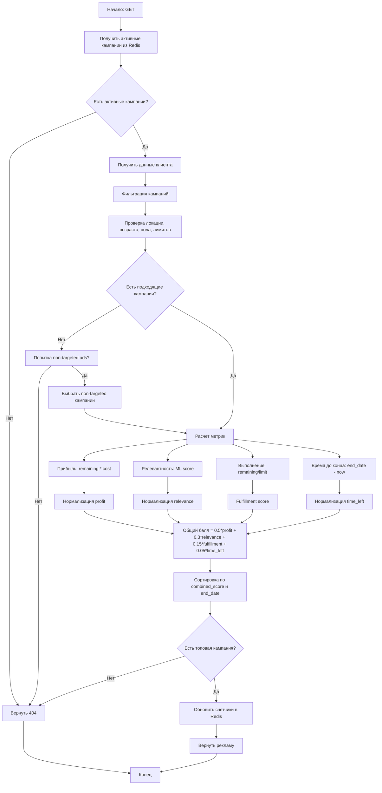

## Algorithm



## Scripts

### How do work with [project](/scripts/project.bat)?

This documentation provides a guide on how to use the provided `.bat` or `.sh` script, which allows the user to start services locally or in Docker containers with various actions such as running or building services.

### Usage

To run the script, execute it in the command line with the required parameters. Use the following syntax:

For Windows:
```shell
.\project.bat [options] [service]
```

For Unix/Linux:
```shell
./project.sh [options] [service]
```

### Options

| Option             | Short Form | Description                                  |
|--------------------|------------|----------------------------------------------|
| --local            | -L         | Start services locally                       |
| --docker           | -D         | Start services in Docker                     |
| --run              | -R         | Run the service(s)                           |
| --build            | -B         | Build the service(s)                         |
| --help             |            | Display the help message                     |
| --tests            |            | Run tests defined in the testing suite       |
| --tests --init     |            | First Run tests defined in the testing suite |

### Example Usage

- Start all services locally and run them:
    - Windows:
      ```shell
      .\project.bat --local --run
      ```
    - Unix/Linux:
      ```shell
      ./equivalent.sh --local --run
      ```

- Build a specific service locally:
    - Windows:
      ```shell
      .\project.bat --local travel_service --build
      ```
    - Unix/Linux:
      ```shell
      ./equivalent.sh --local travel_service --build
      ```

- Start services using Docker:
    - Windows:
      ```shell
      .\project.bat --docker --run
      ```
    - Unix/Linux:
      ```shell
      ./equivalent.sh --docker --run
      ```

- View help information:
    - Windows:
      ```shell
      .\project.bat --help
      ```
    - Unix/Linux:
      ```shell
      ./equivalent.sh --help
      ```

- Run tests:
    - Windows:
      ```shell
      .\project.bat --tests
      ```
    - Unix/Linux:
      ```shell
      ./equivalent.sh --tests
      ```
- First run tests:
    - Windows:
      ```shell
      .\project.bat --tests --init
      ```
    - Unix/Linux:
      ```shell
      ./equivalent.sh --tests --init
      ```


### Parameter Definitions

- **mode**: Determines whether the script will execute commands locally or in Docker. It can be set to `local` or `docker`.
- **action**: Specifies the action to perform, which can be either `run` or `build`.
- **service**: (Optional) The specific service you want to target for the action.

### Internal Flow

- **Argument Parsing**:
    - The script uses a loop to parse command line arguments.
    - It checks for mode and action flags and sets the corresponding variables.
    - If an invalid argument is provided, it uses the remaining argument as a service name.

- **Execution**:
    - After parsing, it checks if the required mode and action have been specified.
    - If a specific service is provided, the script will run it; otherwise, it will run all services.

- **Commands Execution**:
    - **For Local Mode**:
        - Executes the specified action on all or a specific service using the appropriate build or run commands.
  
    - **For Docker Mode**:
        - Uses `docker-compose` commands to start the services as needed.

### Error Handling

- If neither `--local` nor `--docker` is provided, the script will inform the user about the missing mode.
- If neither `--run` nor `--build` is specified, the user will receive a notification prompting them to specify an action.
