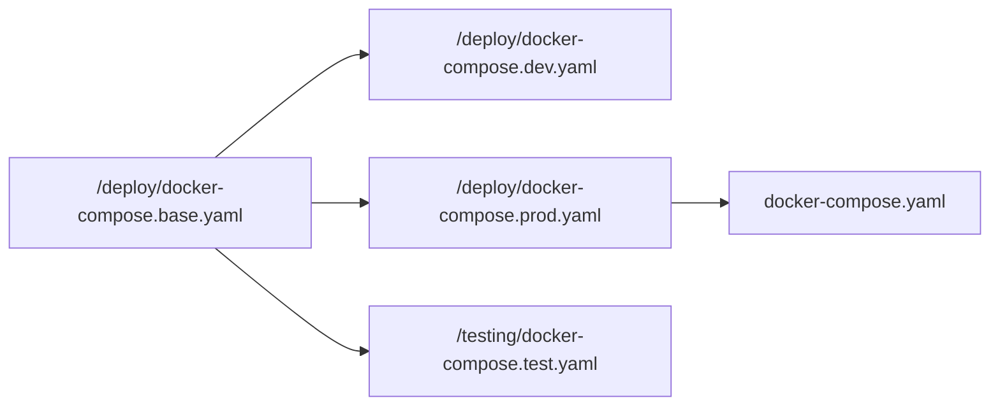
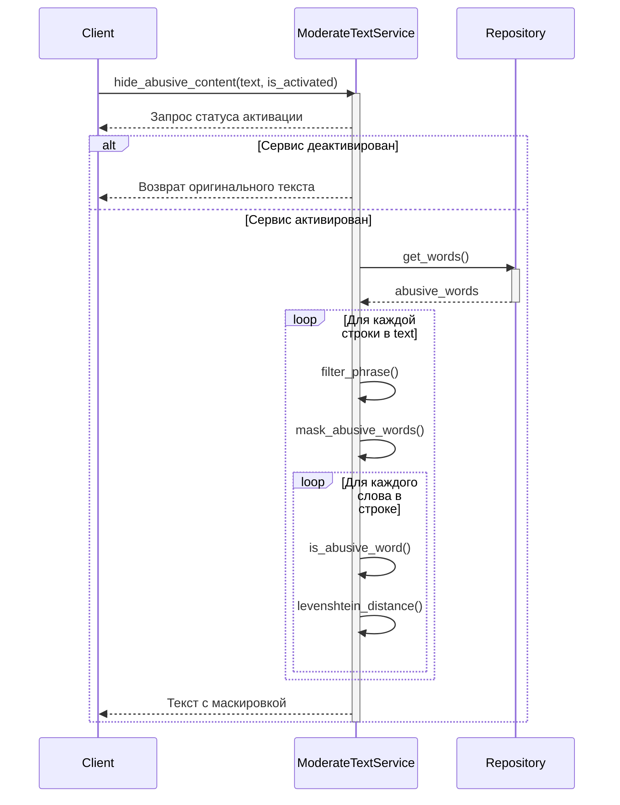
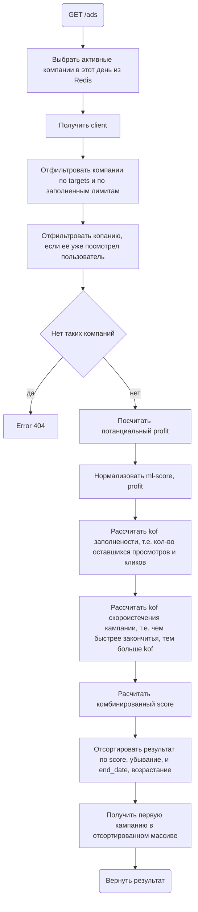

# AdEngine для PROD'a

Просмотрет мою работу вы можете благодяря ╰(\*°▽°\*)╯:

| Сервис     | Путь                                                             | Параметры входа                   |
| ---------- | ---------------------------------------------------------------- | --------------------------------- |
| Swager     | [127.0.0.1:8000/docs/](http://127.0.0.1:8000/docs/)              |                                   |
| Tg bot     | [@ad_engine_from_prod_bot](https://t.me/ad_engine_from_prod_bot) |                                   |
| Prometheus | [127.0.0.1:9090/](http://127.0.0.1:9090/)                        |                                   |
| Grafana    | [127.0.0.1:3000/](http://127.0.0.1:3000/)                        | login: `admin`  password: `44541` |

## Launch

1) Clone репозитория

  ```powershell
  git clone https://gitlab.prodcontest.ru/2025-final-projects-back/IOSHED.git
  ```

2) Установите `docker-compose`

3) Перейдите в директорию solution

  ```powershell
  cd solution
  ```

4) Запустите мой контейнер [`docker-compose`](/solution/docker-compose.yaml):

  ```powershell
  docker-compose up -d
  ```

### Устройство моего контейнера

[Контейнер](/solution/docker-compose.yaml) содержит:

| Сервис       | Предназначение                                  | Зависит от           |
| ------------ | ----------------------------------------------- | -------------------- |
| grafana      | Просмотр метрик                                 | `prometheus`         |
| prometheus   | Хранение метрик                                 | `ad_engine`          |
| postgres     | Хранение долговременных данныех                 |                      |
| redis        | Кеширование и хранение недолговремеенных данных |                      |
| ad_engine    | `Http` сервис предоставляющий API AdEngin       | `postgres`, `redis`  |
| telegram_bot | Телеграм бот, использующий `ad_engine`          | `ad_engine`, `redis` |

Все `docker-compose` наследуются, для более тонкой настройки по рпимеру схемы:


## Technologies used

| Технология                             | №1                                              | №2                                                   | №3                                      |
| -------------------------------------- | ----------------------------------------------- | ---------------------------------------------------- | --------------------------------------- |
| Grafana                                | Гибкая настройка графиков                       | Продвинутый и красивый ui                            | Богатое сообщетво пользователей         |
| Prometheus                             | Возможность гибких запросов к данным            | Система опрашивания других сервисов для сбора метрик | Простота хранения метрик                |
| Postgres                               | Универсальная `SQL` база данных                 | Бескрайние возмодности плагинов                      |                                         |
| Redis                                  | Хранение данных в оперативной памяти (скорость) | Простота использования                               | Самая популярная `in-memory` база даных |
| Aiogram dialog + Python (telegram_bot) | Табличная система создания диалогов             | Гибкие callback'и                                    | Скорость разработки бота                |
| Actix + Rust (ad_engine)               | Высокая производительность                      | Простая документация                                 | Множество `futures` из других `crates`  |
| Sqlx + Rust (ad_engine)                | Чистые `SQL` запросы                            | Простая система миграций                             | Множество `futures` из других `crates`  |
| Yandex GPT                             | Российский разработчик                          | Высокая скорость генерации текста                    | Относительная дешевизна тарифов         |

## Main Endpoints

Упомянуты будут только главные и уникальные `endpoint'ы`.

### Campaigns

Генератор текста для рекламных компаний (PATCH `/advertisers/{advertiser_id}/campaigns/{campaign_id}/generate_text`):

Использует yandex gpt, отсылая ей `http` запрос. Если коректный ответ не был получен возвращается ошибка `503`. Применяется только для уже созданных рекламных компаний, и вызвращает результат в ввиде изменённой сущности `campaign`.
Для запроса следует указать:

- ad_text (опционально): ключевые слова для текста рекламы. Если не указано, то ключевые слова беруться из уже созданной `campaign`.
- ad_title (опционально): ключевые слова для заголовка рекламы. Если не указано, то ключевые слова беруться из уже созданной `campaign`.
- generate_type (ALL | TEXT | TITLE): указывает какие текстовые поля сгенерировать для `campaign`.

Input json example:
  ```json
  {
    "ad_text": "Пользовательские ключевые слова для содержимого рекламы",
    "ad_title": "Пользовательские ключевые слова для заголовка рекламы",
    "generate_type": "ALL"
  }
  ```
 
Output json example:
  ```json
    {
    "ad_title": "Nt",
    "ad_text": "His omega must be Ad",
    "advertiser_id": "3fa85f64-5717-4562-b3fc-2c963f66afa6",
    "campaign_id": "3fa85f64-5717-4562-b3fc-2c963f66afa6",
    "clicks_limit": 105,
    "impressions_limit": 25,
    "cost_per_clicks": 150,
    "cost_per_impressions": 100,
    "end_date": 5,
    "start_date": 3,
    "targeting": {}
  }
  ``` 

Настройка осуществляется путём редактирования файлов конфигураций в [`ad_engine`](/solution/microservices/ad_engine/conf/base.yaml)

| Настройка                        | Тип               | Описание                                                            |
| -------------------------------- | ----------------- | ------------------------------------------------------------------- |
| temperature                      | float (от 0 до 1) | Креативность ответов `llm`                                          |
| max_tokens                       | integer (от 1)    | Ограничение на ответ нейросети в виде количества токенов            |
| system_prompt_for_generate_title | string            | Системный промт для генерации текста заголовка рекламной кампании   |
| system_prompt_for_generate_body  | string            | Системный промт для генерации текста содержимого рекламной кампании |

### Images

| Путь                                                                      | Метод  | Краткое описание                                                                                                            |
| ------------------------------------------------------------------------- | ------ | --------------------------------------------------------------------------------------------------------------------------- |
| `/advertisers/{advertiser_id}/campaigns/{campaign_id}/images`             | GET    | Получает список имён всех загруженных фотографий в рекламную кампанию                                                       |
| `/advertisers/{advertiser_id}/campaigns/{campaign_id}/images`             | POST   | Загружает фотографии (храня её в `postgres`) в рекламную кампанию, используя  заголовок `Content-Type: multipart/form-data` |
| `/advertisers/{advertiser_id}/campaigns/{campaign_id}/images/{file_name}` | DELETE | Удаляет фотографию из рекламной кампании по имени                                                                           |
| `/advertisers/{advertiser_id}/campaigns/{campaign_id}/images/{file_name}` | GET    | Получает фотографию рекламной кампании по имени                                                                             |

Настройка осуществляется путём редактирования файлов конфигураций в [`ad_engine`](/solution/microservices/ad_engine/conf/base.yaml)

| Настройка             | Тип            | Описание                                                                    |
| --------------------- | -------------- | --------------------------------------------------------------------------- |
| support_mime          | array string   | Определяет поддерживаемые `mime` типы данных для загрузки.                  |
| max_size              | integer (от 0) | Ограничение на размер одного изображения в килобайтах                       |
| max_image_on_campaign | integer (от 0) | Количество фотографий, разрешённых на хранение для одной рекламной кампании |
| limit_size_media      | integer (от 0) | Ограничение на размер группы мультиссмедий в килобайтах                     |

### Moderate

| Путь               | Метод  | Краткое описание                                         |
| ------------------ | ------ | -------------------------------------------------------- |
| `/moderate/config` | POST   | Включает/выключает модерацию текста во всем `ad_engine`  |
| `/moderate/list`   | POST   | Добавляет слова в чёрный список                          |
| `/moderate/list`   | DELETE | Удаляет слова из чёрного списка (является идемпотентным) |
| `/moderate/list`   | GET    | Получает слова из чёрного списка                         |

| Настройка   | Тип               | Описание                                                                                                                                                                |
| ----------- | ----------------- | ----------------------------------------------------------------------------------------------------------------------------------------------------------------------- |
| sensitivity | float (от 0 до 1) | Устанавливает чувствительность к словам и словоформам из чёрного списка (0 — самая низкая вувствительность, 1 — очень высокая). Рекомендую значения от `0.5` до `0.25`. |
При включенной модерации не получиться создать `client`, `advertiser`, `campaign` со словами или словоформами из чёрного списка. Будет ошибка `406` с `"reason": "Not acceptable words - {word}"`.

Если же вы добавили слово в чёрный список, когда уже сохранена `campaign`, то при получении `ads` (GET `/ads`) запретное слово будет заменено на `***`. Например, если запрещено слово `плохо`, то из текста `Это не хорошо, а пло][о.` клиент увидит `Это не хорошо, а ***.`

Это достигается благодаря моему алгоритму, включающий алгоритм Левенштейна:


### ADS

Выдача наиболее подходящей рекламы (GET `/ads`).

Вот как работает основной алгоритм:


| Настройка          | Тип               | Описание                                                                  |
| ------------------ | ----------------- | ------------------------------------------------------------------------- |
| weight_profit      | float (от 0 до 1) | Вес важности потанцельной прибыли                                         |
| weight_relevance   | float (от 0 до 1) | Вес важности релевантности рекламы                                        |
| weight_fulfillment | float (от 0 до 1) | Вес важности ненаполнености рекламы (недополучение потанциальной прибыли) |
| weight_time_left   | float (от 0 до 1) | Вес важности продвижения реклам, которые подходят к концу                 |

## View Tg Bot

TODO: write

## Schema database


## Scripts

### Как работать с [project](/solution/scripts/project.bat)?

Эта документация предоставляет руководство по использованию предоставленного скрипта `.bat` или `.sh`, который позволяет пользователю запускать сервисы локально или в контейнерах Docker с различными действиями, такими как запуск или сборка сервисов.

### Usage

Чтобы запустить скрипт, выполните его в командной строке с необходимыми параметрами. Используйте следующий синтаксис:

Для Windows:
```shell
.\project.bat [options] [service]
```

Для Unix/Linux:
```shell
./project.sh [options] [service]
```

### Options

| Option         | Short Form | Description                       |
| -------------- | ---------- | --------------------------------- |
| --local        | -L         | Запустить сервисы локалько        |
| --docker       | -D         | Запустить сервисы в докер         |
| --run          | -R         | Запустить сервис(ы)               |
| --build        | -B         | Собрать сервис(ы)                 |
| --help         |            | Вывести help сообщение            |
| --tests        |            | Запустить `unit` и `e2e` тесты    |
| --tests --init |            | Запустить тестировние впервый раз |

### Example Usage

- Start all services locally and run them:
    - Windows:
      ```shell
      .\project.bat --local --run
      ```
    - Unix/Linux:
      ```shell
      ./equivalent.sh --local --run
      ```

- Build a specific service locally:
    - Windows:
      ```shell
      .\project.bat --local travel_service --build
      ```
    - Unix/Linux:
      ```shell
      ./equivalent.sh --local travel_service --build
      ```

- Start services using Docker:
    - Windows:
      ```shell
      .\project.bat --docker --run
      ```
    - Unix/Linux:
      ```shell
      ./equivalent.sh --docker --run
      ```

- View help information:
    - Windows:
      ```shell
      .\project.bat --help
      ```
    - Unix/Linux:
      ```shell
      ./equivalent.sh --help
      ```

- Run tests:
    - Windows:
      ```shell
      .\project.bat --tests
      ```
    - Unix/Linux:
      ```shell
      ./equivalent.sh --tests
      ```
- First run tests:
    - Windows:
      ```shell
      .\project.bat --tests --init
      ```
    - Unix/Linux:
      ```shell
      ./equivalent.sh --tests --init
      ```

### Parameter Definitions

- **mode**: Определяет, будет ли скрипт выполнять команды локально или в Docker. Может быть установлен в `local` или `docker`.
- **action**: Указывает действие, которое необходимо выполнить, которое может быть либо `run`, либо `build`.
- **service**: (Необязательно) Конкретный сервис, который вы хотите выбрать для действия.

### Error Handling

- Если не указан ни `--local`, ни `--docker`, скрипт уведомит пользователя о недостаточной информации по режиму.
- Если не указано ни `--run`, ни `--build`, пользователь получит уведомление с просьбой указать действие.
