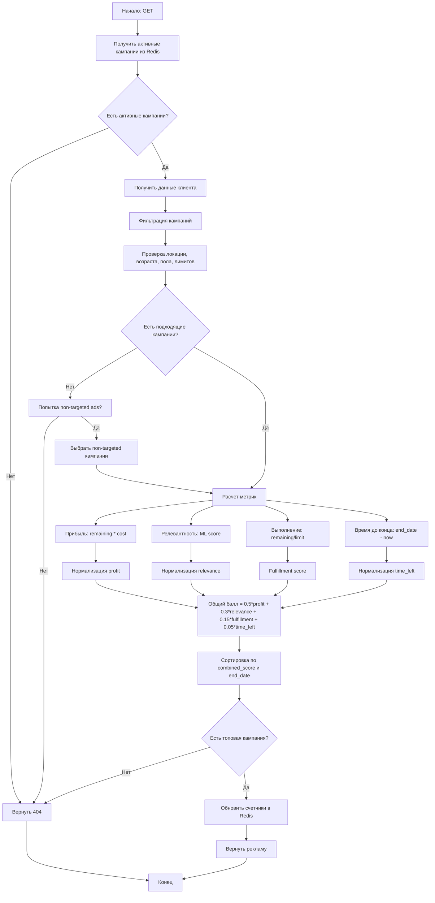

## Algorithm
Левенштейна
Если нет пользователей с таким taget надо их 


## Scripts

### Как работать с [project](/solution/scripts/project.bat)?

Эта документация предоставляет руководство по использованию предоставленного скрипта `.bat` или `.sh`, который позволяет пользователю запускать сервисы локально или в контейнерах Docker с различными действиями, такими как запуск или сборка сервисов.

### Usage

Чтобы запустить скрипт, выполните его в командной строке с необходимыми параметрами. Используйте следующий синтаксис:

Для Windows:
```shell
.\project.bat [options] [service]
```

Для Unix/Linux:
```shell
./project.sh [options] [service]
```

### Options

| Option             | Short Form | Description                                  |
|--------------------|------------|----------------------------------------------|
| --local            | -L         | Запустить сервисы локалько                   |
| --docker           | -D         | Запустить сервисы в докер                    |
| --run              | -R         | Запустить сервис(ы)                          |
| --build            | -B         | Собрать сервис(ы)                            |
| --help             |            | Вывести help сообщение                       |
| --tests            |            | Запустить `unit` и `e2e` тесты               |
| --tests --init     |            | Запустить тестировние впервый раз            |

### Example Usage

- Start all services locally and run them:
    - Windows:
      ```shell
      .\project.bat --local --run
      ```
    - Unix/Linux:
      ```shell
      ./equivalent.sh --local --run
      ```

- Build a specific service locally:
    - Windows:
      ```shell
      .\project.bat --local travel_service --build
      ```
    - Unix/Linux:
      ```shell
      ./equivalent.sh --local travel_service --build
      ```

- Start services using Docker:
    - Windows:
      ```shell
      .\project.bat --docker --run
      ```
    - Unix/Linux:
      ```shell
      ./equivalent.sh --docker --run
      ```

- View help information:
    - Windows:
      ```shell
      .\project.bat --help
      ```
    - Unix/Linux:
      ```shell
      ./equivalent.sh --help
      ```

- Run tests:
    - Windows:
      ```shell
      .\project.bat --tests
      ```
    - Unix/Linux:
      ```shell
      ./equivalent.sh --tests
      ```
- First run tests:
    - Windows:
      ```shell
      .\project.bat --tests --init
      ```
    - Unix/Linux:
      ```shell
      ./equivalent.sh --tests --init
      ```


### Parameter Definitions

- **mode**: Определяет, будет ли скрипт выполнять команды локально или в Docker. Может быть установлен в `local` или `docker`.
- **action**: Указывает действие, которое необходимо выполнить, которое может быть либо `run`, либо `build`.
- **service**: (Необязательно) Конкретный сервис, который вы хотите выбрать для действия.

### Internal Flow

- **Парсинг аргументов**:
    - Скрипт использует цикл для разбора аргументов командной строки.
    - Он проверяет наличие флагов режима и действия и устанавливает соответствующие переменные.
    - Если предоставлен недопустимый аргумент, он использует оставшийся аргумент в качестве имени сервиса.

- **Выполнение**:
    - После разбора скрипт проверяет, указаны ли необходимые режим и действие.
    - Если указан конкретный сервис, скрипт запустит его; в противном случае он запустит все сервисы.

- **Выполнение команд**:
    - Для локального режима:
        - Выполняет указанное действие на всех или конкретном сервисе с использованием соответствующих команд сборки или запуска.

    - Для режима Docker:
        - Использует команды `docker-compose` для запуска сервисов по необходимости.

### Error Handling

- Если не указан ни `--local`, ни `--docker`, скрипт уведомит пользователя о недостаточной информации по режиму.
- Если не указано ни `--run`, ни `--build`, пользователь получит уведомление с просьбой указать действие.
